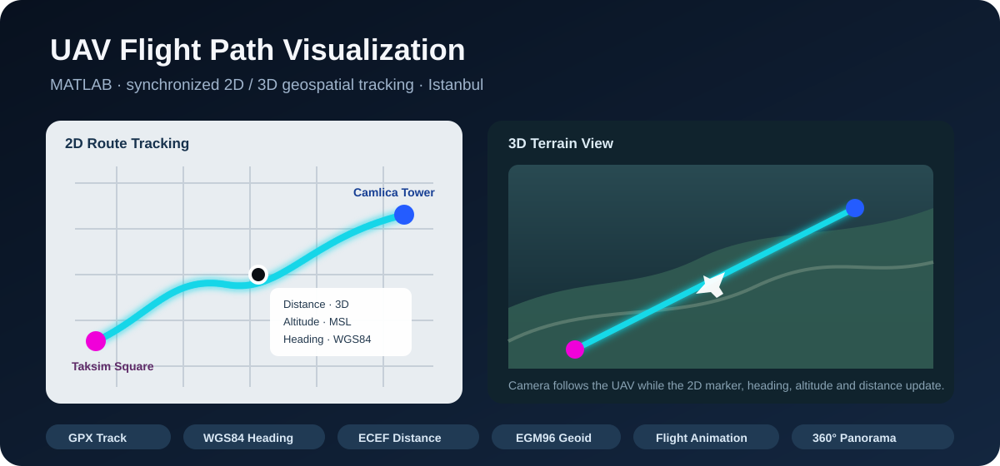

<div align="center">

# UAV Flight Path Visualization

### MATLAB-based UAV flight simulation with synchronized 2D & 3D geospatial views

[](https://www.mathworks.com/products/mapping.html)
[](#academic-context)
[](#academic-context)

**Taksim Square → Camlica Tower · Istanbul, Türkiye**

</div>

<p align="center">
  
</p>

## Overview

This repository contains the implementation of my **2024 Computer Engineering undergraduate thesis**, focused on visualizing a simulated UAV flight path on synchronized **2D geographic maps** and a **3D geographic globe** in MATLAB.

The application loads a GPX flight track, calculates UAV heading and cumulative three-dimensional travel distance, displays live navigation information, animates the UAV route from **Taksim Square** to **Camlica Tower**, and performs a 360° camera rotation at the destination.

> Thesis title: **“UAV Uçuş Yolunu 2-B ve 3-B Haritalarda Görselleştirme”**

## Working Demonstration

The submitted working recordings were reviewed while reconstructing this repository. They show the MATLAB implementation rendering the route in 2D, opening a synchronized 3D terrain view, updating the current UAV position and navigation data, and moving the 3D camera along the simulated flight.

See [`docs/demo.md`](docs/demo.md) for a concise description of the recorded behavior.

## Features

- **2D geospatial visualization** with `geoaxes` and `geoplot`
- **3D terrain visualization** with `geoglobe` and `geoplot3`
- **GPX flight-track import** with `readgeotable`
- **Heading calculation** using the WGS84 ellipsoid
- **EGM96 geoid conversion** for elevation handling
- **3D route-distance calculation** using ECEF offsets
- **Animated UAV route tracking** with a moving 3D camera
- **Live telemetry-style data tips** for distance, altitude and heading
- **360° panorama rotation** at the destination

## How It Works


The implementation converts route elevations to WGS84 ellipsoidal height before computing point-to-point 3D offsets. The resulting cumulative distance is synchronized with the animated route and displayed alongside heading and altitude.

For a more detailed breakdown, see [`docs/architecture.md`](docs/architecture.md).

## Project Structure

```text
uav-flight-path-visualization/
├── assets/
│   └── hero.svg
├── data/
│   └── README.md
├── docs/
│   ├── architecture.md
│   ├── demo.md
│   ├── references.md
│   └── thesis-summary.md
├── src/
│   └── uav_flight_path_visualization.m
├── .gitignore
├── CITATION.cff
└── README.md
```

## Requirements

- MATLAB
- Mapping Toolbox
- Internet access for online geographic basemaps / terrain tiles
- A GPX file named `sample_uavtrack.gpx` with a `track_points` layer

The original project expects `sample_uavtrack.gpx`. The GPX file was not present in the thesis materials available when this repository was reconstructed, so no synthetic replacement is included. See [`data/README.md`](data/README.md).

## Running the Project

1. Clone this repository.
2. Place the original `sample_uavtrack.gpx` file in the repository's `data/` directory.
3. Open MATLAB and make sure **Mapping Toolbox** is installed.
4. Run:

```matlab
run("src/uav_flight_path_visualization.m")
```

The script creates the initial geographic view, calculates route metrics, renders synchronized 2D/3D views, and animates the UAV flight.

## Technical Notes

For the thesis demonstration, the source report records a total UAV tracking distance of approximately:

```text
7,532.953887 meters
```

The implementation uses an EGM96 geoid correction before ECEF-based three-dimensional distance calculation. This means the distance calculation accounts for changes in both geographic position and elevation rather than treating the route as a flat 2D path.

## Academic Context

This project was developed as an **Undergraduate Thesis / Senior Design Project** in the **Computer Engineering Department, Bolu Abant Izzet Baysal University**, in 2024.

- **Author:** Bekir Oruk
- **Advisor:** Assoc. Prof. Dr. Murat Beken
- **Area:** UAV simulation, geospatial visualization, route tracking

A concise academic summary is available in [`docs/thesis-summary.md`](docs/thesis-summary.md).

## Source Material & Repository Reconstruction

The repository has been organized from the final thesis report and recorded demonstrations of the working MATLAB implementation. The code in `src/` follows the final implementation documented in the thesis, while comments and file organization were cleaned up for reproducibility and portfolio presentation.

Personal information that is not necessary for the technical project (such as student number, phone number and private contact details) is intentionally excluded.

## Future Improvements

Potential extensions include real-time UAV telemetry input, live GPS tracking, obstacle-aware path planning, route optimization, automatic panorama export, and integration with a physical UAV or flight controller.

## Author

**Bekir Oruk**  
Computer Engineer  
GitHub: [@bekiroruk](https://github.com/bekiroruk)  
Website: [bekiroruk.dev](https://bekiroruk.dev)

---

> This repository is shared as an academic/portfolio project. No open-source license is currently provided.
