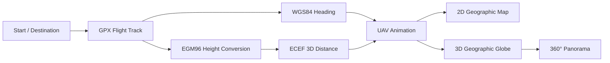

<div align="center">

# UAV Flight Path Visualization

### 2D & 3D UAV route simulation and geospatial visualization in MATLAB

[](https://www.mathworks.com/products/mapping.html)


**Bolu Abant İzzet Baysal University · Computer Engineering · 2024**

</div>

<p align="center">
  
</p>

## About the Project

**UAV Uçuş Yolunu 2-B ve 3-B Haritalarda Görselleştirme** is my undergraduate Computer Engineering thesis project.

The project visualizes a simulated UAV flight using MATLAB. It combines a **2D geographic map** and a **3D geographic globe**, loads a flight track from GPX data, calculates heading and three-dimensional route distance, and animates the UAV while updating position, altitude, distance and heading information.

The thesis demonstration is built around the **Taksim Square → Camlica Tower** scenario.

## What the Application Does



The project performs the following steps:

- plots the selected locations on a **2D satellite map**,
- creates synchronized **2D and 3D geographic views**,
- imports the flight track from `sample_uavtrack.gpx`,
- calculates UAV heading using the **WGS84 ellipsoid**,
- converts route elevations with the **EGM96 geoid model**,
- calculates cumulative **3D distance** using ECEF offsets,
- renders the route with `geoplot` and `geoplot3`,
- updates the current UAV position during the animation,
- displays **distance, altitude and heading** as live data tips,
- moves the 3D camera along the simulated flight,
- rotates the destination camera through **360°**.

## Project Result

The final thesis reports a total simulated UAV tracking distance of:

> **7,532.953887 meters**

The supplied GPX route contains **19 track points**, with elevation values from **50 m to 230 m**.

## Original MATLAB Project

The original working folder was:

```text
VisualizeUAVFlightPathOn2DAnd3DMaps/
```

The repository now preserves that same project identity. The readable MATLAB source export and the actual GPX route are versioned together:

```text
VisualizeUAVFlightPathOn2DAnd3DMaps/
├── VisualizeUAVFlightPathOn2DAnd3DMaps.m
├── sample_uavtrack.gpx
└── README.md
```

The original development file is **`VisualizeUAVFlightPathOn2DAnd3DMaps.mlx`**. The `.m` file in the repository is a readable export of the code cells from that Live Script so the implementation can be inspected directly in GitHub.

## Working Demo

The original project includes a **2 minute 50 second** screen recording of the working MATLAB application:

- **1914 × 1068**
- **30 fps**
- **H.264 video**
- **AAC audio**

The recording demonstrates the real 2D/3D flight visualization, current-location tracking, route animation and destination panorama behavior.

Technical details of the recording are documented in [`docs/demo.md`](docs/demo.md).

## Repository Structure

```text
uav-flight-path-visualization/
├── VisualizeUAVFlightPathOn2DAnd3DMaps/
│   ├── VisualizeUAVFlightPathOn2DAnd3DMaps.m
│   ├── sample_uavtrack.gpx
│   └── README.md
├── assets/
│   └── hero.svg
├── docs/
│   ├── architecture.md
│   ├── demo.md
│   ├── original-artifacts.md
│   ├── references.md
│   └── thesis-summary.md
├── .gitattributes
├── .gitignore
├── CITATION.cff
└── README.md
```

## Requirements

- **MATLAB**
- **Mapping Toolbox**
- Internet connection for geographic basemap / terrain tiles

The implementation uses MATLAB functionality including:

`geoaxes` · `geoplot` · `geoglobe` · `geoplot3` · `readgeotable` · `azimuth` · `egm96geoid` · `ecefOffset`

## Run

Clone the repository and switch to the original project directory:

```bash
git clone https://github.com/bekiroruk/uav-flight-path-visualization.git
cd uav-flight-path-visualization/VisualizeUAVFlightPathOn2DAnd3DMaps
```

Then open MATLAB in that directory and run:

```matlab
VisualizeUAVFlightPathOn2DAnd3DMaps
```

The GPX file is intentionally stored beside the MATLAB project source because the original Live Script loads it with:

```matlab
T = readgeotable("sample_uavtrack.gpx", Layer="track_points");
```

## Technical Highlights

| Area | Implementation |
|---|---|
| 2D visualization | `geoaxes`, `geoplot` |
| 3D visualization | `geoglobe`, `geoplot3` |
| Flight data | GPX `track_points` |
| Heading | `azimuth` + WGS84 |
| Elevation correction | EGM96 geoid |
| 3D distance | ECEF offsets + Euclidean distance |
| Animation | `campos`, `camheight`, `campitch`, `camheading` |
| Live information | MATLAB `datatip` |
| Final view | 360° camera rotation |

## Academic Context

This project was prepared as a **Computer Engineering Undergraduate Thesis** at **Bolu Abant İzzet Baysal University, Faculty of Engineering** in 2024.

**Thesis:** *UAV Uçuş Yolunu 2-B ve 3-B Haritalarda Görselleştirme*  
**Author:** Bekir Oruk  
**Advisor:** Assoc. Prof. Dr. Murat Beken

See [`docs/thesis-summary.md`](docs/thesis-summary.md) for a concise technical summary.

## Documentation

- [Architecture](docs/architecture.md)
- [Working demo](docs/demo.md)
- [Thesis summary](docs/thesis-summary.md)
- [Original artifact hashes](docs/original-artifacts.md)
- [Thesis references](docs/references.md)

## Author

**Bekir Oruk**  
Computer Engineer  
GitHub: [@bekiroruk](https://github.com/bekiroruk)  
Portfolio: [bekiroruk.dev](https://bekiroruk.dev)

---

<p align="center">
  <sub>Undergraduate thesis project · MATLAB · UAV Simulation · Geospatial Visualization</sub>
</p>
