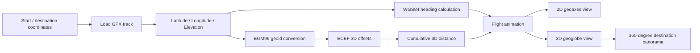

# Architecture

The project is a MATLAB-based geospatial visualization pipeline. It takes a GPX UAV route, derives navigation metrics, and renders synchronized 2D and 3D views while animating the aircraft path.

## Main MATLAB Components

| Component | Purpose |
|---|---|
| `geoaxes`, `geoplot` | 2D geographic visualization |
| `geoglobe`, `geoplot3` | 3D terrain and route visualization |
| `readgeotable` | Read GPX route points |
| `azimuth` | Calculate UAV heading |
| `egm96geoid` | Convert orthometric to ellipsoidal height |
| `ecefOffset` | Calculate 3D point-to-point offsets |
| `campos`, `camheight`, `campitch`, `camheading` | Animate the 3D camera |
| `datatip` | Display distance, altitude and heading during flight |

## Coordinate / Distance Logic

The source route elevations are referenced to mean sea level. For three-dimensional distance calculations, the implementation converts them to WGS84 ellipsoidal heights using the EGM96 geoid model and then calculates ECEF offsets between consecutive track points.
